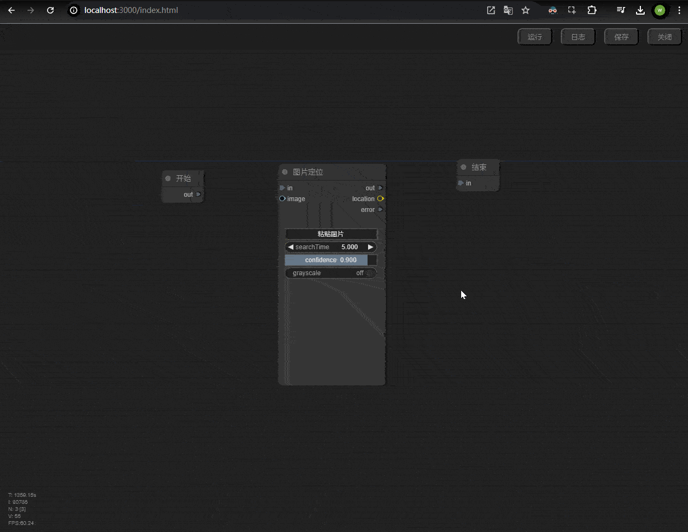
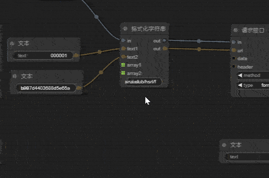
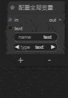
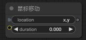

# 刀锋面板
- [刀锋面板](#刀锋面板)
  - [1. 📃项目简介](#1-项目简介)
  - [2.🚀快速入门](#2快速入门)
    - [2.1💡界面简介](#21界面简介)
    - [2.2 ➕添加应用](#22-添加应用)
    - [2.3 🎛️系统设置](#23-️系统设置)
  - [3. 🖥️桌面使用教程](#3-️桌面使用教程)
    - [3.1  修改布局](#31--修改布局)
    - [3.2 切换桌面](#32-切换桌面)
    - [3.3 应用移动桌面](#33-应用移动桌面)
    - [3.4 新增桌面](#34-新增桌面)
  - [4. 📱应用教程](#4-应用教程)
    - [4.1 分享应用](#41-分享应用)
    - [4.2 导入应用](#42-导入应用)
    - [4.3 自定义图标](#43-自定义图标)
  - [5. 📚脚本教程](#5-脚本教程)
    - [5.1 基础操作](#51-基础操作)
      - [双击空白处搜索节点](#双击空白处搜索节点)
      - [新增节点](#新增节点)
      - [节点操作](#节点操作)
      - [节点连接](#节点连接)
      - [测试运行](#测试运行)
    - [5.1 自动化脚本编写](#51-自动化脚本编写)
      - [点击指定图片示例](#点击指定图片示例)
    - [5.2 自定义组件编写](#52-自定义组件编写)
      - [必应搜索示例](#必应搜索示例)
      - [进阶搜索示例](#进阶搜索示例)
    - [5.3 节点介绍](#53-节点介绍)
      - [基础节点分组](#基础节点分组)
      - [编程节点分组](#编程节点分组)
      - [输入节点分组](#输入节点分组)
      - [自动化节点分组](#自动化节点分组)
      - [组件节点分组](#组件节点分组)
      - [模拟节点分组](#模拟节点分组)
      - [绘图节点分组](#绘图节点分组)

## 1. 📃项目简介
* 💻️这是一个开源的副屏面控制台。</br>
* 🎴主要用于快速启动`应用`、`网页`、`文件`、`指令`。</br>
* 📟️并支持`可视化脚本编程`。

## 2.🚀快速入门
本软件启动后回自动用浏览器打开面板，默认地址为🌍️：`http://127.0.0.1:58433`

### 2.1💡界面简介


***添加主机***</br>

* 本系统支持 `🌐浏览器`、`📱安卓应用`。需要电脑端和手机端连接 🌐同一个`局域网`。


### 2.2 ➕添加应用
***添加网页链接***


### 2.3 🎛️系统设置

* 修改壁纸
  
壁纸支持的格式: `📷jpg`, `🖼️png`, `🎬mp4`


* 修改主题模式

本软件支持 🌜`暗黑模式`、🌞`白天模式`。


## 3. 🖥️桌面使用教程

### 3.1  修改布局
点击右上角的 📏`布局`按钮，即可修改布局。修改完成时需要再次点击保存布局 🔄。


### 3.2 切换桌面
* 桌面内的应用支持 🔄`多级桌面`。
* 也支持在添加应用内新增一个桌面 📲。


### 3.3 应用移动桌面
* 可以将指定软件 📤移动到其他桌面。


### 3.4 新增桌面
* 可以在添加应用内新增一个桌面 📲。


## 4. 📱应用教程

### 4.1 分享应用
* 右键点击应用 🖱️，然后点击分享 🔄。浏览器就会自动下载分享包 📥。

### 4.2 导入应用
* 点击右上角的 🛠️`控制中心`, 然后点击 📥`导入应用`.


### 4.3 自定义图标
* 在 🆕`新增应用` 的时候可以自定义图标。

目前支持三种图标方式：
1. 使用第三方图片地址作为图标 🌐.
2. 点击上传按钮，使用本地图片作为图标 📂.
3. 使用 🖼️`图标库` 中图标（支持自选图标，自定义图标颜色、图标背景）。点击 🎨`自定义` 按钮，然后可在搜索栏搜索图标。可在结果中选择图标 🔄.


## 5. 📚脚本教程
* 本软件支持 📊`可视化脚本编程`.
* 脚本语言是使用 🐍`python` 实现.
* 节点编程是线性运行，所以节点之间是 🔄`顺序执行`.

目前脚本编程主要有两个功能：
1. 自动化脚本 🤖.
2. 自定义组件 🛠️.

目前支持的节点有：
```
"基础/开始(CMDStart)"
"基础/结束(CMDEnd)"
"基础/合并运行(MultiMerge)"
"基础/跳转运行(JumpNode)"

"绘图/开始(DisplayStart)"
"绘图/布局(DisplayGrid)"
"绘图/图片(DisplayImage)"
"绘图/文字(DisplayText)"
"绘图/输入框(DisplayInput)"
"绘图/折线图(DisplayLineChart)"
"绘图/按钮(DisplayButton)"
"绘图/选择框(DisplaySelector)"

"编程/等待(TimeWait)"
"编程/请求接口(FetchApi)"
"编程/获取JSON参数(GetJson)"
"编程/判断(IfValid)"
"编程/选择结构(switchValid)"
"编程/格式化字符串(FormatText)"
"编程/记录日志(logDebug)"
"编程/配置局部变量(SetLocalVariables)"
"编程/获取局部变量(GetLocalVariables)"
"编程/配置全局变量(SetGlobalVariables)"
"编程/获取全局变量(GetGlobalVariables)"

"输入/文本(TextInput)"
"输入/列表(ArrayInput)"
"输入/图片(ImageInput)"

"自动化/图片定位(LocateOnScreenNode)"
"自动化/查找图片(FindImage)"
"自动化/运行软件(startApp)"
"自动化/打开链接(openLink)"

"组件/实例化(Subgraph)"
"组件/输入(SubgraphInput)"
"组件/输出(SubgraphOutput)"

"模拟/快捷键(Hotkeys)"
"模拟/文本输入(TypeText)"
"模拟/鼠标移动(MouseMove)"
"模拟/鼠标左键(MouseLeft)"
"模拟/鼠标中键(MouseMiddle)"
"模拟/鼠标右键(MouseRight)"
```
### 5.1 基础操作

#### 双击空白处搜索节点


#### 新增节点
右键点击空白处 🖱️，然后点击 🆕`Add Node`.


#### 节点操作
1. 按住 ⌃`Ctrl` 然后移动鼠标可以选择多个节点 🖱️.
2. 选择节点后，点击 ⌃`Ctrl+C` 复制节点 📋.
3. 点击 🗑️`Del` 删除节点.
4. 左键点击节点，可以移动点击的节点 🔄.
5. 选择节点后，按住 ⇧`Shift`, 移动鼠标，可以拖动 🔄`多个节点`.


#### 节点连接
相同颜色和形状的节点可以连接 🔗.


#### 测试运行
* 点击右上角的 🚀`运行` 按钮，即可运行脚本.
* 然后点击 📋`日志` 按钮，即可查看运行日志.


### 5.1 自动化脚本编写
* 自动化脚本的开始节点是`基础/开始(CMDStart)`</br>
* 结束节点是`基础/结束(CMDEnd)`</br>

#### 点击指定图片示例
这个示例是：
通过用户上传的图标，去点击 Windows 系统中任务栏中的 🪟 按钮.


### 5.2 自定义组件编写

* 自定义组件是使用`脚本编程`编写的
* 以`绘图/开始(DisplayStart)` 节点开始
* 以`绘图/布局(DisplayGrid)` 节点结束

</br>

* 组件的布局方式是 **grid** (网格布局) 📐
* 通过点击 `左侧按钮` 可以新增元素 🚀
* 将布局内的元素拖拽到 `删除` 按钮可以删除元素 🗑️
  
目前 `自定义组件` 支持的元素有：🎉
1. 纯文本 📝 (支持自定义点击脚本)
2. 图片 🖼️ (支持自定义点击脚本)
3. 输入框 📋 (`Enter` 键触发自定义点击脚本)
4. 折线图 📈
5. 按钮 🔄 (支持自定义点击脚本)
6. 选择框 📊

以上元素的样式和内容都可以通过请求 **三方API** 🌐 获取的数据来设置。

#### 必应搜索示例
点此下载该应用：[必应搜索](./static/share/bing搜索_share_2024-07-25_09-51-32.zip)</br>


#### 进阶搜索示例
该示例还支持 **自选搜索引擎** 🔍 并且会自动保存选择的搜索引擎 💾。

点此下载该应用：[进阶搜索](./static/share/搜索一下_share_2024-07-25_10-00-24.zip)</br>


### 5.3 节点介绍

#### 基础节点分组

***基础/开始(CMDStart)***</br>

* 开始节点，用于运行脚本. 🚀
* `自动化脚本` 默认开始运行的节点. 🔄

</br>


***基础/结束(CMDEnd)***</br>
* 开始节点，用于运行脚本. 🚀
* `自动化脚本` 默认结束运行的节点. 

</br>


***基础/合并运行(MultiMerge)***</br>

* 当多个节点需要运行 `同一节点`，可以使用这个节点. 🔄  
* 点击 `+` 可以添加输入端口. 🔄  
* 点击 `-` 可以删除输入端口. 🗑️

</br>

***基础/跳转运行(JumpNode)***</br>

* 该节点出现的主要目的使编程界面更加简洁，以避免连接线的`交错过多`，不便阅读。
* 当多个节点需要跳转运行`同一节点`，可以使用这个节点。
* 跳转节点只会跳转到相同`name`的节点。
* 相同`name`的节点可以有`多个`连接了`输入端口`的节点。但只能有`一个`连接`输出端口`的节点。
* 并且跳转到的节点的`输出端口`必须`链接其他节点`才能成功跳转。

</br>


#### 编程节点分组
主要用于数据处理，以及逻辑处理。</br>

***编程/等待(TimeWait)***</br>

* 这里可以设置等待时间（毫秒: 1000ms=1s）。
* 运行到该节点时，程序会等待设置的时间。

</br>

***编程/请求接口(FetchApi)***</br>

* 目前只支持返回体为json的接口。

输入端口：
1. `url` 要请求的url
2. `data` 其中一行一个，键名与键值用同一行，并用`:`隔开，必须是英文的符号
3. `header` 格式要求和data一样
   
配置参数：
1. `method` 请求的方法，默认为`GET`
2. `type` 请求的类型，默认为`form-data`
   
输出端口：
1. `out` 请求成功执行该输出连接的节点
2. `response` (string) 返回的data
3. `error` 请求失败执行该输出连接的节点
   
</br>
   
***编程/获取JSON参数(GetJson)***</br>

* 该节点用于获取json数据中的指定键值。
* 也可以获取数组

</br>

以下json为例：</br>
```json
[
    {
        "d": "2024-07-19",
        "t": "15:00:00",
        "v": "1137500",
        "p": "10.37"
    },
    {
        "d": "2024-07-19",
        "t": "14:57:00",
        "v": "307500",
        "p": "10.38"
    },
    {
        "d": "2024-07-19",
        "t": "14:56:00",
        "v": "605600",
        "p": "10.37"
    },
    {
        "d": "2024-07-19",
        "t": "14:55:00",
        "v": "951700",
        "p": "10.38"
    },
    {
        "d": "2024-07-19",
        "t": "14:54:00",
        "v": "267700",
        "p": "10.39"
    },
    {
        "d": "2024-07-19",
        "t": "09:30:00",
        "v": "227400",
        "p": "10.38"
    }
]
```
输入端口中的path的规则为：</br>
1. 获取多层级的键值，每个键名用`.`隔开</br>
2. 获取列表的所有元素：`*`</br>
3. 获取列表中第3个：`2.t`("14:56:00")</br>
4. 获取列表中的最后一个：`-1.t`("09:30:00")</br>
5. 获取列表中后3个元素：`-3:.t`</br>
```json
[
  "14:55:00",
  "14:54:00",
  "09:30:00"
]
```
1. 获取列表中前3个元素：`3:.t`</br>
```json
[
  "15:00:00",
  "14:57:00",
  "14:56:00"
]
```


***编程/判断(IfValid)***</br>

* 判断input1和input2是否相等，如果相等则执行true，否则执行false。

</br>


***编程/选择结构(switchValid)***</br>

* 判断开头为valid的输入是否和input相等。
* 如果相等就执行valid后对应数字的输出节点。
* 如果都不匹配就执行error的输出节点。
* 可以点击`+`添加输入端口。
* 点击`-`删除输入端口。

</br>


***编程/格式化字符串(FormatText)***</br>

* 主要在字符串中插入变量。</br>

</br>


***编程/记录日志(logDebug)***</br>

* 系统日志，用于调试。
* 选择type然后点击`+`添加对应类型的输入端口。
* 点击`-`删除输入端口。
* 日志的路径为：软件安装路径/logs
* 日志存放的格式：年/月/日.log
例如：2023/07/19.log </br>

</br>


***所有的变量都是要相同`name`和`type`才能获取成功***

***编程/配置局部变量(SetLocalVariables)***</br>

* 记录局部变量，用于该脚本使用。
* 选择type然后点击`+`添加对应类型的输入端口。
* 点击`-`删除输入端口。
* 输入`name`为变量名。

</br>


***编程/获取局部变量(GetLocalVariables)***</br>

* 获取局部相同`name`的变量，用于该脚本使用。
* 选择type然后点击`+`添加对应类型的输出端口。
* 点击`-`删除输出端口。
* 输入`name`为变量名。

</br>


***编程/配置全局变量(SetGlobalVariables)***</br>
* 记录全局变量，用于该软件的所有脚本使用。
* 选择type然后点击`+`添加对应类型的输入端口。
* 点击`-`删除输入端口。
* 输入`name`为变量名。

</br>


***编程/获取全局变量(GetGlobalVariables)***</br>
* 获取全局相同`name`的变量，用于该软件的所有脚本使用。
* 选择type然后点击`+`添加对应类型的输出端口。
* 点击`-`删除输出端口。
* 输入`name`为变量名。

</br>


#### 输入节点分组
* 可以添加一个默认的文本、列表、图片。

***输入/文本(TextInput)***</br>
* 定义一个输入文本节点。

</br>


***输入/列表(ArrayInput)***</br>
* 一行一个元素。

</br>


***输入/图片(ImageInput)***</br>
* 点击`上传图片`可以从本地选择图片。

</br>

* 点击`粘贴图片`从剪贴板中粘贴图片。

</br>


#### 自动化节点分组

***自动化/图片定位(LocateOnScreenNode)***</br>
* 根据输入的图片，在屏幕上定位。
* 当找到图片时，会返回图片的中心坐标。并执行`out`连接的节点
* 没有找到图片时，会执行`error`连接的节点。

参数说明：</br>
1. `searchTime`：N秒内在屏幕中搜索图片的所在位置，单位为秒，默认为5s。</br>
2. `confidence`: 相似度，默认0.9。</br>
3. `grayscale`: 定位函数以稍微加快速度（大约 30%）。这会降低图像和屏幕截图的颜色饱和度，从而加快定位速度，但可能会导致误报匹配</br>

</br>


***自动化/查找图片(FindImage)***</br>
* 与`自动化/图片定位(LocateOnScreenNode)`相比，`自动化/查找图片(FindImage)`可以找到多个图片。
* 参数说明可以参考`自动化/图片定位(LocateOnScreenNode)`
* 程序会从第一张图片开始找，找到就会执行对应的输出接口。
* 没有找到图片时，会执行`error`连接的节点。
* 点击`+`添加图片输入接口和执行输出接口。
* 点击`-`删除图片输入接口和执行输出接口。

</br>


***自动化/运行软件(startApp)***</br>
* `启动软件`或用`指定软件`打开指定文件/文件夹

参数说明：</br>
1. `path`: 要打开的软件的路径。当为 `$path` 的时候会获取该桌面应用的路径</br>
2. `folder`: 文件夹地址</br>

</br>


***自动化/打开链接(openLink)***</br>
* 用默认浏览器打开链接

</br>


#### 组件节点分组

* 可以将多个节点封装成一个组件。
* 组件可以嵌套使用。
* 但是不能使用绘图相关的节点。
* 将多个复用的节点封装成一个组件。


***组件/实例化(Subgraph)***</br>

* 组件内部的节点可以和外部的节点进行连接。
* 创建组件实例后，可以点击`+`添加输入端口和输出端口。
* 新增端口的时候`name`为端口的名字，可以自定义。
* `type`为端口的类型。目前只支持(`cmd`,`text`,`array`,`location`,`response`)

</br>

* 进入和推出组件内部

</br>

* 组件内部节点的输出端口可以和组件外部的输入端口进行连接。
* 也可以在组件内部添加输入和输出端口。

</br>


***组件/输入(SubgraphInput)***</br>

* 此节点只能在`组件内部`使用。
* 用于在组件`内部接收`组件外输入的数据。


***组件/输出(SubgraphOutput)***</br>

* 此节点只能在`组件内部`使用。
* 用于将`组件内`的输出到`外部组件节点`的输出中。


#### 模拟节点分组
***模拟/快捷键(Hotkeys)***</br>
* 模拟键盘操作
* 录制按键

</br>

参数说明：</br>
1. `inputType`: `hotkeys`同时按下和松开所有按键,`typeWrite`依次点击每个按键,`keyDown`同时按住按键不放,`keyUp`同时松开按键</br>
2. `keys`: 输入的按键


***模拟/文本输入(TypeText)***</br>
* 将value的内容和输入

</br>


***模拟/鼠标移动(MouseMove)***</br>
* 移动鼠标到指定位置。

参数说明：</br>
1. `location`: x,y坐标。优先使用`输入接口`的坐标，当有`输入接口`的坐标时，`location`内的坐标用于从中心点开始偏移，如果为`x,y`就不偏移。当没有输入接口的坐标时，就用location内的坐标，从屏幕左上角开始，单位是px(像素点)</br>
2. `duration`: 移动到目标位置的时间，单位是s(秒)</br>
   
</br>


***模拟/鼠标左键(MouseLeft)***</br>
* 鼠标左键点击。

参数说明：
1. `type`: `click`、`mouseDown`、`mouseUp` 分别代表:`点击`、`按下`、`抬起`</br>

</br>

***模拟/鼠标中键(MouseMiddle)***</br>
* 鼠标中键点击/滚动。

参数说明：</br>
1. `type`: `click`、`scrollUp`、`scrollDown` 分别代表:`点击`、`向上滚动`、`向下滚动`</br>

</br>

***模拟/鼠标右键(MouseRight)***</br>
* 鼠标右键点击一下。
  
</br>


#### 绘图节点分组
* 以`绘图/开始(DisplayStart)` 节点开始
* 以`绘图/布局(DisplayGrid)` 节点结束
* 所有的`元素节点`只能连接到`显示布局`上

***样式说明***</br>

* 所有的节点都支持自定义样式，自定义样式采用React的css语法。
* 样式为文本输入，一行一个

***参数说明***</br>
`variant`: 显示样式</br>
1. `plain`</br>

1. `outlined`</br>

1. `soft`</br>

1. `solid`</br>


`color`: 颜色</br>


***绘图/开始(DisplayStart)***</br>
* 自定义显示组件从此开始执行

***绘图/布局(DisplayGrid)***</br>

</br>

* 自定义显示组件必须`从此结束`
* 自定义显示组件是使用`grid`(网格布局)进行布局
* `添加`和`删除`元素的时候都会动态修改`输入接口`

**修改网格大小**</br>
</br>

**添加元素**</br>
</br>

**删除元素**</br>
</br>


***绘图/图片(DisplayImage)***</br>

</br>

**onClick**
* 当客户端点击时，会从onClick开始执行脚本


***绘图/文字(DisplayText)***</br>

</br>

* ``text``输入接口：显示的文本内容

**noWrap**</br>
* 为`off`时，文本内容会`自动换行`
* 为`on`时，文本内容`不会换行`

**level**
* 字体大小，所有选项：由上到下依次变小

**onClick**
* 当客户端点击时，会从`onClick`开始执行脚本

***绘图/输入框(DisplayInput)***</br>


**placeholder**
* 空白时显示的文本
**value**输入接口：
* 设置输入框的默认内容
**value**输出接口：
* 获取输入框内容


***绘图/折线图(DisplayLineChart)***</br>


**title** 抬头显示文本</br>


* `data`: 数据内容
* `name`: 对应数据的标题
* `xAxis`: x轴坐标内容
* `onClick`: 点击事件(目前未开发)


***绘图/按钮(DisplayButton)***</br>


* `placeholder`: 占位文本
* `onClick`: 点击事件


***绘图/选择框(DisplaySelector)***</br>


* `placeholder`: 占位文本
* `data`: 选择框数据内容
* `default`: 默认选中项
* `onChange`: 选择框内容变化事件(目前未开发)
* `value`: 选择框选中内容